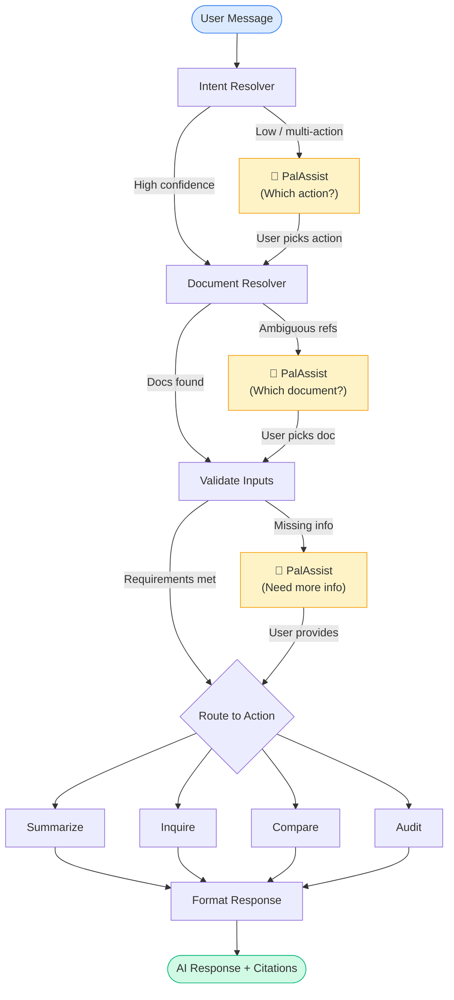
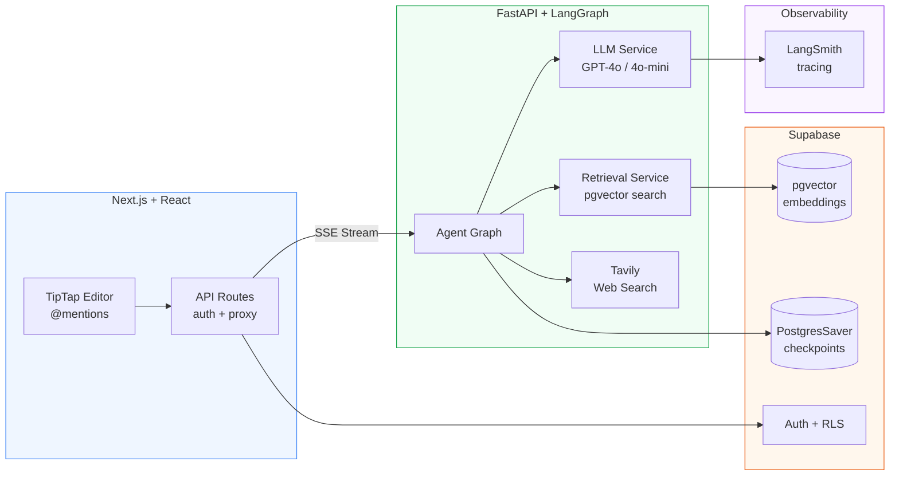
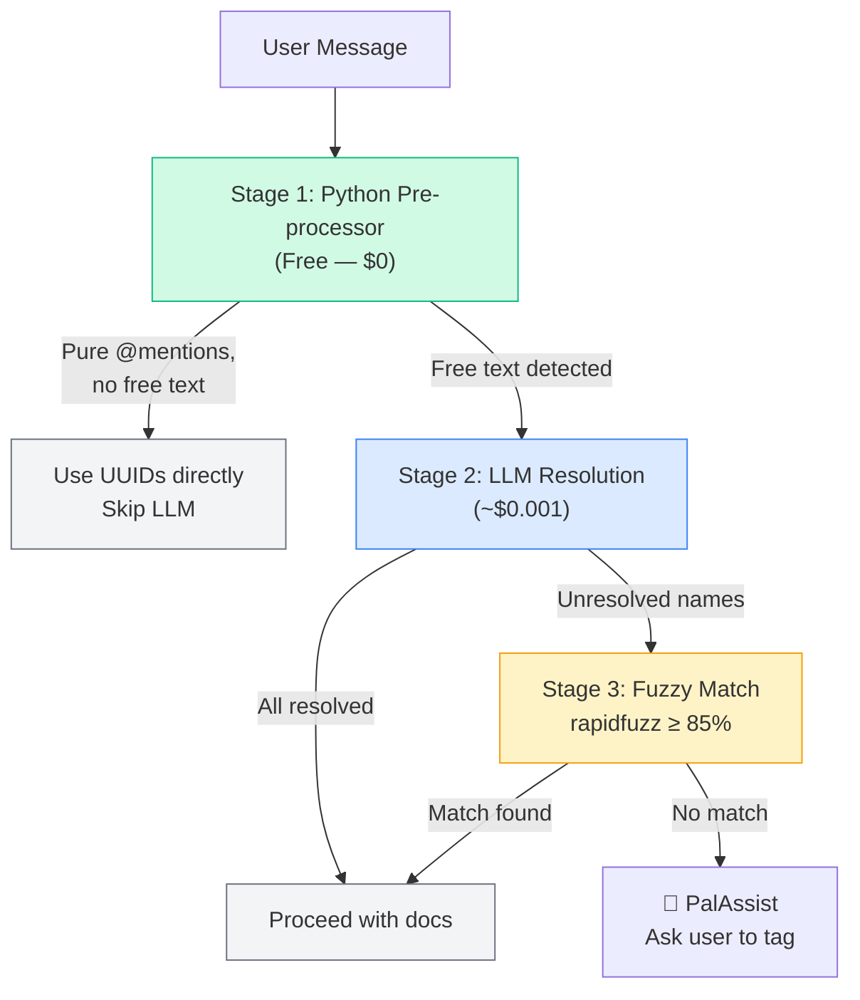

# PolicyPal — AI Compliance Agent

> Compliance officers spend weeks reading 100+ page regulatory documents. PolicyPal does it in seconds — with citations, confidence scoring, and an audit trail.

<!-- TODO: Add hero screenshot or demo GIF here -->
<!--  -->

---

## The Problem

In financial institutions, compliance teams manually cross-reference company policies against regulatory documents from bodies like Bank Negara, FSA, and ISO standards. A single audit cycle can take **weeks of manual reading** — and missing a clause can mean fines, license revocations, or worse.

PolicyPal is a **production-grade AI agent** that automates this. Upload your regulatory docs, ask questions in plain English, and get cited, confidence-scored answers — not hallucinated guesses.

---

## The AI Agentic Solution

PolicyPal isn't a chatbot with a system prompt. It's a **stateful agent** that reasons about your request, finds the right documents, picks the right strategy, and knows when to stop and ask instead of guess.

| Capability | What It Means | Why It Matters |
|:-----------|:-------------|:---------------|
| **Stateful Graph Orchestration** | LangGraph state machine with 8 nodes, conditional routing, and persistent checkpoints | The agent can pause mid-execution, ask the user a question, and resume from the exact same state — even after a browser refresh |
| **Smart Context Resolution** | 3-stage doc resolution: Python pre-processor → LLM inference → fuzzy match fallback | Users say "audit against those two docs" and the agent resolves "those two" from conversation history. 39% of queries resolve at $0 |
| **Action-Specific Retrieval** | Each of the 4 actions owns its own RAG strategy (adaptive-k, stratified sampling, theme-based, dual-mode) | A summarization task needs broad coverage; a Q&A task needs precision. One retrieval pipeline can't do both well |
| **Dual Confidence Scoring** | Inference confidence (right docs?) + retrieval confidence (right evidence?) — measured separately | The agent knows when it's uncertain and stops to ask instead of hallucinating. Two scores because "found the right doc" ≠ "found the right answer" |
| **Hybrid Model Routing** | GPT-4o for high-stakes tasks (audit, holistic compare), GPT-4o-mini for routine (summarize, inquire) | ~60% cost reduction with no quality loss on extraction tasks. Model choice is abstracted behind an LLM service layer |
| **Human-in-the-Loop** | LangGraph `interrupt()` pauses the graph; PalAssist prompts the user; `Command(resume=...)` continues | Never guesses when uncertain — asks. Compliance is not the domain for "best effort" answers |
| **Real-Time Agent Transparency** | SSE events stream node-by-node status (PalReasoning) as the graph executes | Users see "Finding documents..." → "Auditing against regulations..." in real time. Builds trust, eliminates the black-box feeling |
| **Persistent Memory** | PostgresSaver checkpointer + `conversation_docs` registry that accumulates across turns | Close your browser, come back tomorrow — the agent remembers every document discussed in this conversation |

---

## What It Does

| Action | What It Solves | How It Works |
|--------|---------------|--------------|
| **Summarize** | "I don't have time to read this 80-page regulation" | Stratified sampling across the full document for balanced coverage |
| **Inquire** | "What are the capital requirements in Section 4?" | Adaptive-k semantic search — retrieves until relevance drops off |
| **Compare** | "What changed between the 2024 and 2025 versions?" | Theme extraction + cross-document analysis (focused or holistic) |
| **Audit** | "Does our AML policy comply with Bank Negara?" | Dual-mode: short text (direct search) or full policy (per-theme retrieval against targets) |

Each action uses a **different retrieval strategy** — not one-size-fits-all RAG. More on that [below](#retrieval-strategies).

---

## Architecture

The core of PolicyPal is a **stateful LangGraph agent** — not a simple prompt-response chain. The graph can pause mid-execution to ask the user for clarification, then resume exactly where it left off with full state preserved.



Every yellow node is a **LangGraph `interrupt()`** — the graph freezes, state gets persisted to Postgres, and the user sees an inline prompt (PalAssist). When they respond, the graph picks up from that exact checkpoint. No context lost, no re-running previous nodes.

### System Overview



---

## Smart Context Resolution

This is the feature I'm most proud of. In real conversations, people don't re-tag documents every message:

> **Message 1:** "Compare @BankNegara2024 and @BankNegara2025"  
> **Message 2:** "Now audit our policy against those two docs"

"Those two docs" — a human knows what that means. PolicyPal does too.

The document resolver uses a **3-stage pipeline** that handles explicit tags, implicit references, and typos:



A `conversation_docs` registry (`{ "Bank Negara 2024": "uuid-xyz" }`) accumulates across every turn and persists via the checkpointer. So even after a browser refresh, the agent remembers which documents were discussed.

**Cost breakdown:** ~39% of queries resolve for $0 (explicit tags), ~25% for $0.001 (registry hit), ~35% for $0.002 (history scan). The expensive path is rare.

---

## Retrieval Strategies

Every action owns its retrieval — this was a deliberate design choice. A summarization task needs broad document coverage; a Q&A task needs precise, high-similarity chunks. One retrieval strategy can't serve both well.

| Action | Strategy | Why |
|--------|----------|-----|
| **Summarize** | Stratified sampling — 4 bands × 4 chunks/doc | Ensures beginning, middle, and end are all represented. You can't summarize a document from just the intro |
| **Inquire** | Adaptive-k — retrieve until similarity drops below 0.5 | Stops at the natural relevance boundary instead of an arbitrary top-k. Some questions need 3 chunks, others need 12 |
| **Compare** | Mode-dependent — LLM classifies focused vs holistic first | "Compare capital requirements" needs targeted search. "Compare these two regulations" needs broad coverage + theme extraction |
| **Audit** | Dual-mode — short text (direct embed) vs long policy (theme → per-theme retrieval) | A 50-word email gets embedded directly. A 30-page policy needs theme extraction first to avoid bias toward the first section |

### Hybrid Model Routing

Not every task needs GPT-4o. An LLM service abstraction routes by action type:

| Task | Model | Reasoning |
|------|-------|-----------|
| Summarize, Inquire, Compare (focused) | GPT-4o-mini | Extraction and targeted Q&A — RAG provides the context |
| Compare (holistic), Audit | GPT-4o | Multi-theme synthesis and legal risk analysis need stronger reasoning |
| Intent/doc resolution | GPT-4o-mini | Classification tasks — doesn't need full model |

**Result:** ~60% cost reduction vs using GPT-4o for everything, with no measurable quality loss on routine tasks.

---

## Dual Confidence System

Two separate confidence scores, at different stages, measuring different things:

| System | Set By | Measures | Triggers |
|--------|--------|----------|----------|
| **Inference Confidence** | Document Resolver | "Did I identify the right documents?" | Medium → PalAssist shows doc options. Low → asks user to tag explicitly |
| **Retrieval Confidence** | Action Nodes (post-RAG) | "Did the chunks actually answer the question?" | Medium → proceed with ⚠️ badge. Low → PalAssist: tag docs / search web / continue |

This distinction matters. You can have high inference confidence (you know which doc the user means) but low retrieval confidence (the doc doesn't contain what they're asking about). Collapsing these into one score would hide useful information.

---

## Challenges & Trade-offs

### Why LangGraph over vanilla LangChain

I started with a standard LangChain chain — `prompt | llm | parser`. It worked for simple Q&A, but fell apart the moment I needed:
- **Conditional routing** — different retrieval strategies per action
- **Mid-flow user interaction** — "which document did you mean?" without losing context
- **State persistence** — resume a conversation after browser refresh

LangChain chains are stateless pipelines. LangGraph gives you a **state machine** with checkpointing, `interrupt()` for human-in-the-loop, and `Command(resume=...)` to pick up exactly where you left off. The trade-off is complexity — the graph builder, state typing, and checkpoint management have a real learning curve. But for an agentic system with branching logic and user interaction, there's no clean alternative.

### The Hallucination Problem → Dual Confidence

Early versions would confidently generate answers even when the retrieved chunks had nothing to do with the question. The model would fill in the gaps with plausible-sounding but fabricated compliance advice — dangerous in a regulatory context.

The fix wasn't just prompt engineering. I added **retrieval confidence scoring** based on average cosine similarity of returned chunks. Below 0.5, the agent *stops and asks* instead of guessing. This single decision eliminated the most dangerous failure mode: a confident wrong answer about regulatory compliance.

I later split this into two confidence systems (inference + retrieval) because I kept seeing cases where the agent knew the right document but couldn't find relevant chunks in it. Separate scores let the UI communicate exactly what's uncertain.

### Interrupt/Resume and the Cancel Workaround

LangGraph's `interrupt()` is powerful but has a known bug in v1.0.x — `Command(resume=None)` crashes the graph. My workaround: a `CANCEL_SENTINEL` string that the receiving node checks for, then uses `Command(goto="format_response")` to skip all downstream nodes and emit a context-specific feedback message. Not elegant, but it ships.

### TipTap @Mentions vs Free-Text Parsing

I could have parsed document names from plain text using NER or regex. Instead, I chose TipTap's Mention extension — users select from a dropdown, and the frontend sends clean UUIDs. Zero ambiguity, zero parsing errors. The trade-off is that it requires a rich text editor (heavier than a plain `<textarea>`), but the UX gain is massive: no typos, no "did you mean X?", and multi-doc tagging becomes trivial.

---

## Tech Stack

| Layer | Technologies |
|-------|-------------|
| **Frontend** | Next.js 15, React 19, TypeScript, TailwindCSS, Shadcn/ui, TipTap, TanStack Query, Framer Motion, Zod |
| **Backend** | Python, FastAPI, LangGraph, LangChain, Pydantic |
| **AI/ML** | GPT-4o + GPT-4o-mini (hybrid), text-embedding-3-small, pgvector (HNSW), Tavily |
| **Database** | Supabase (Postgres, pgvector, Auth, RLS, Storage) |
| **Infrastructure** | Vercel (frontend), Render (backend), PostgresSaver (checkpoints) |
| **Observability** | LangSmith (full trace on every LLM call) |

---

## Features at a Glance

<!-- TODO: Add screenshots for each feature below -->

### Document Management
<!--  -->
Upload PDFs with structured metadata (title, version, doc type, custom color-coded sets). Documents are chunked (1000 chars, 150 overlap), embedded with text-embedding-3-small, and stored in pgvector with HNSW indexing. Processing happens async with real-time status cards (shimmer loading → ready / failed with retry).

### Chat Interface
<!--  -->
TipTap rich text editor with @mention autocomplete across 4 categories: Actions, Document Sets, Documents, and Web Search. Mentions resolve to UUIDs on selection — the backend never parses display text. Messages render as Markdown with inline citation bubbles.

### PalAssist (Human-in-the-Loop)
<!--  -->
When the agent needs clarification, PalAssist appears above the chat input with contextual options (document choices, action selection, or free-text input). The graph is paused — not terminated — so all prior state is preserved. Cancel sends a feedback message and stops the graph cleanly.

### PalReasoning (Live Agent Status)
<!--  -->
While the graph runs, users see node-by-node status via SSE events: "Clarifying intent..." → "Finding documents..." → "Auditing against regulations...". Zero LLM cost — statuses come from a static config map. Resolved document names appear as pills in real-time.

### Sources Panel
<!--  -->
Collapsible right panel showing all citations grouped by document and web sources. Clicking a citation bubble in chat filters the panel to that specific group. Citations include page numbers and exact 2-3 sentence quotes extracted by the LLM.

### Confidence & Cost Tracking
Every AI response shows a confidence badge (✅ high / ⚠️ medium / 🔴 low) and token cost. This isn't cosmetic — compliance officers need to know when to trust an answer and when to verify manually.

---

## Project Structure

```
PolicyPal/
├── src/                          # Next.js frontend
│   ├── app/                      # App router (pages, layouts, API routes)
│   │   ├── dashboard/            # 3-panel layout + conversation routing
│   │   ├── auth/                 # Login, signup, password reset
│   │   ├── onboarding/           # Profile completion gate
│   │   └── api/                  # Proxy routes (auth-injected)
│   ├── components/
│   │   ├── chat/                 # ChatInput, PalAssist, PalReasoning, citations
│   │   ├── dashboard/            # Shell, panels, sources
│   │   ├── documents/            # Upload, edit, library, cards
│   │   └── landing/              # Hero, features, CTA
│   ├── hooks/                    # React Query hooks (queries + mutations)
│   ├── lib/                      # Supabase clients, chat utilities, types
│   └── context/                  # Citation context (cross-panel state)
│
├── backend/                      # FastAPI + LangGraph
│   └── app/
│       ├── graph/
│       │   ├── builder.py        # Graph construction + node wiring
│       │   ├── state.py          # AgentState TypedDict
│       │   └── nodes/            # intent_resolver, doc_resolver,
│       │                         # validate_inputs, summarize, inquire,
│       │                         # compare, audit, format_response
│       ├── services/
│       │   ├── llm_service.py    # Model routing, structured output, cost tracking
│       │   ├── retrieval_service.py  # pgvector search + stratified sampling
│       │   ├── tavily_service.py     # Web search integration
│       │   ├── theme_service.py      # Theme extraction for compare/audit
│       │   └── embedding_service.py  # OpenAI embeddings (batched)
│       ├── routers/
│       │   ├── chat.py           # /chat, /chat/resume (SSE), /chat/history
│       │   └── documents.py      # /ingest, /retry
│       └── models/               # Pydantic schemas (API + action responses)
│
└── supabase/                     # Migrations (schema, RPC functions, indexes)
```

---

## Getting Started

### Prerequisites
- Node.js 18+
- Python 3.11+
- Supabase project (with pgvector enabled)
- OpenAI API key
- Tavily API key (optional — for web search)

### Frontend

```bash
npm install
npm run dev
```

### Backend

```bash
cd backend
python -m venv venv
source venv/bin/activate  # Windows: venv\Scripts\activate
pip install -r requirements.txt
uvicorn app.main:app --reload --port 8000
```

### Environment Variables

```env
# Frontend (.env.local)
NEXT_PUBLIC_SUPABASE_URL=your_supabase_url
NEXT_PUBLIC_SUPABASE_ANON_KEY=your_anon_key
INTERNAL_API_KEY=shared_secret
BACKEND_URL=http://localhost:8000

# Backend (.env)
SUPABASE_URL=your_supabase_url
SUPABASE_SERVICE_KEY=your_service_key
SUPABASE_CONNECTION_STRING=postgresql://...
OPENAI_API_KEY=your_openai_key
TAVILY_API_KEY=your_tavily_key
LANGSMITH_API_KEY=your_langsmith_key
INTERNAL_API_KEY=shared_secret
```

---

## What I'd Do Differently (v2)

- **Streaming token output** — Currently responses arrive as complete messages. Token-by-token streaming would improve perceived latency.
- **Multi-step action chaining** — "Compare these two docs, then audit my policy against the winner." Requires conditional edges and cross-action state passing in LangGraph.
- **Incremental summarization** — Current message windowing regenerates the conversation summary from scratch. An incremental approach would append to the existing summary.
- **Evaluation suite** — Formal RAG evaluation (faithfulness, relevance, citation accuracy) rather than manual testing. Would use RAGAS or a custom eval harness.

---

<p align="center">
  Built by <a href="https://github.com/SyedMeekalZaidi">Meekal</a> — AI Engineer
</p>
